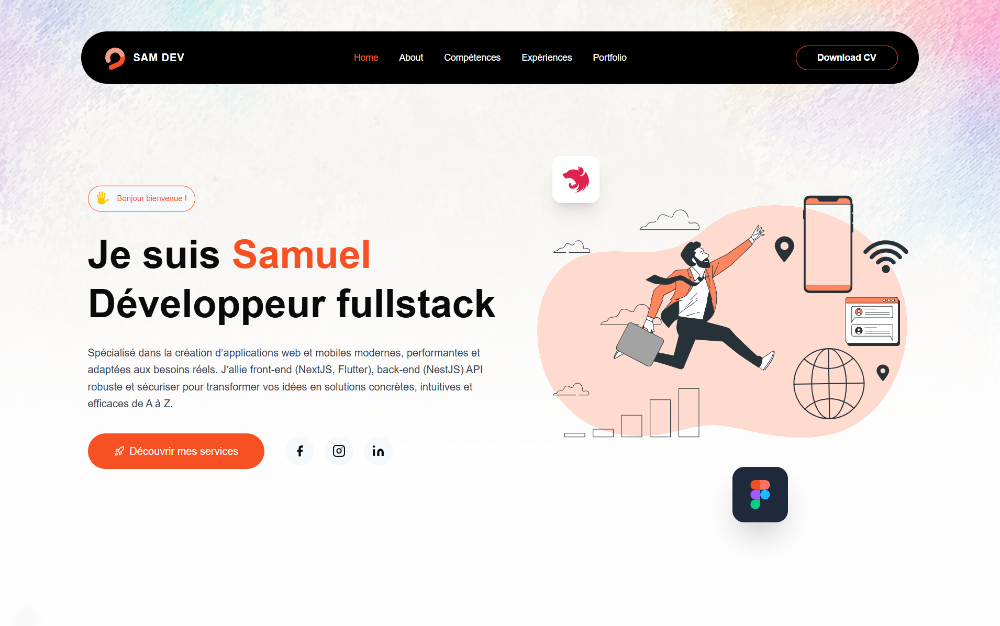
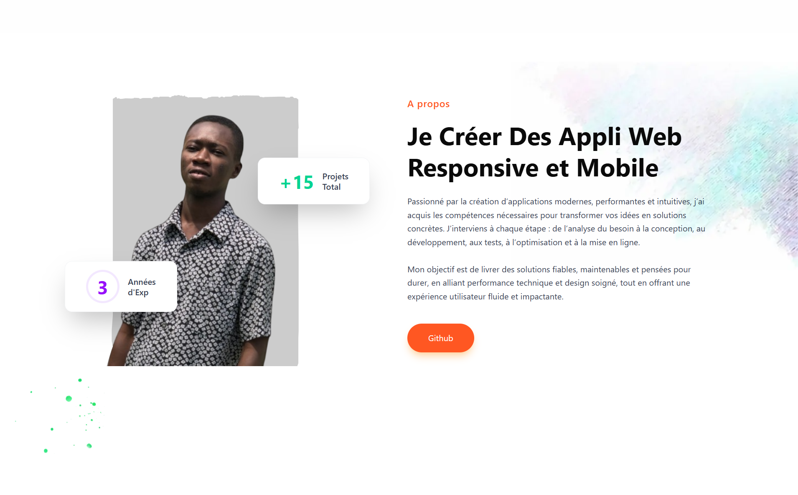
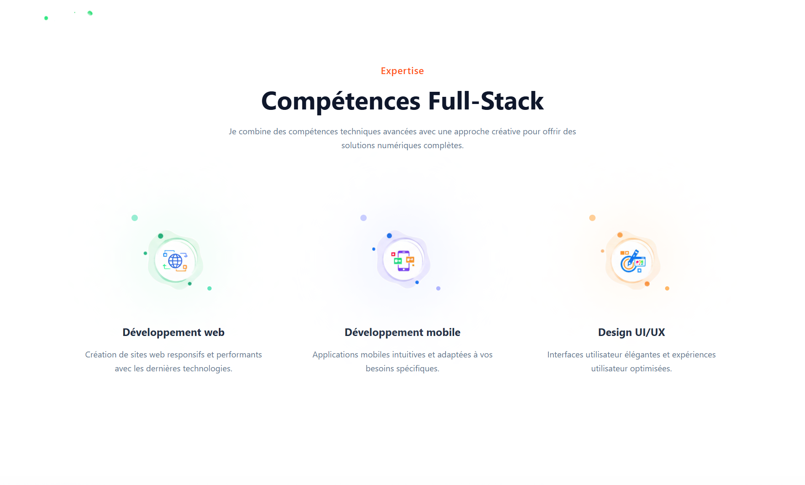
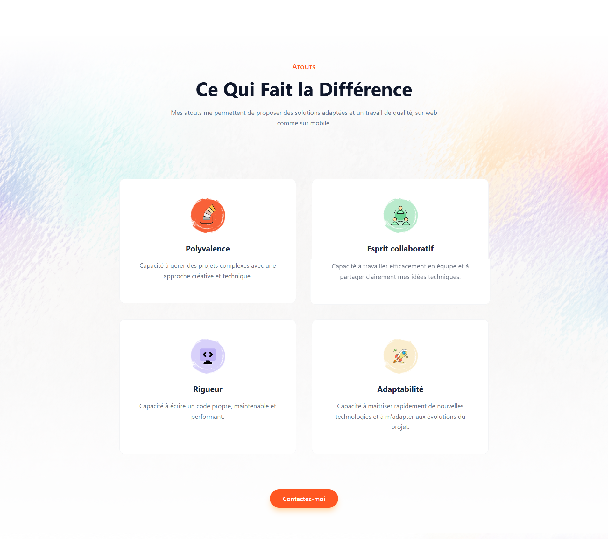
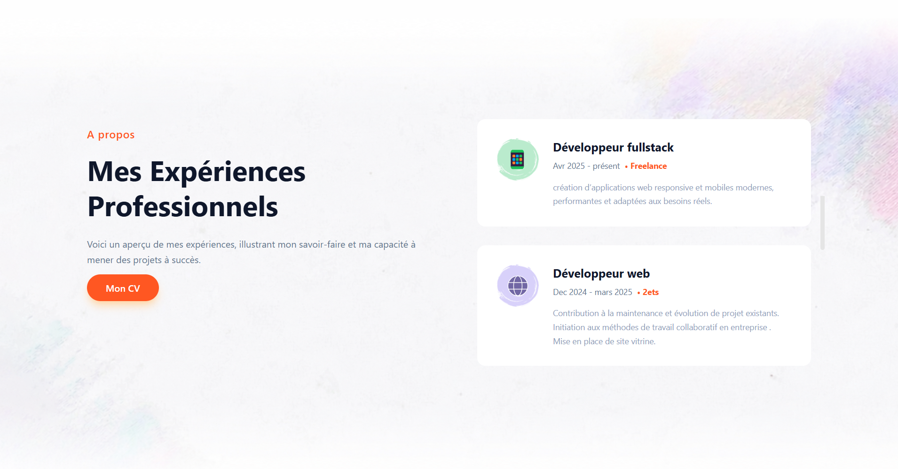
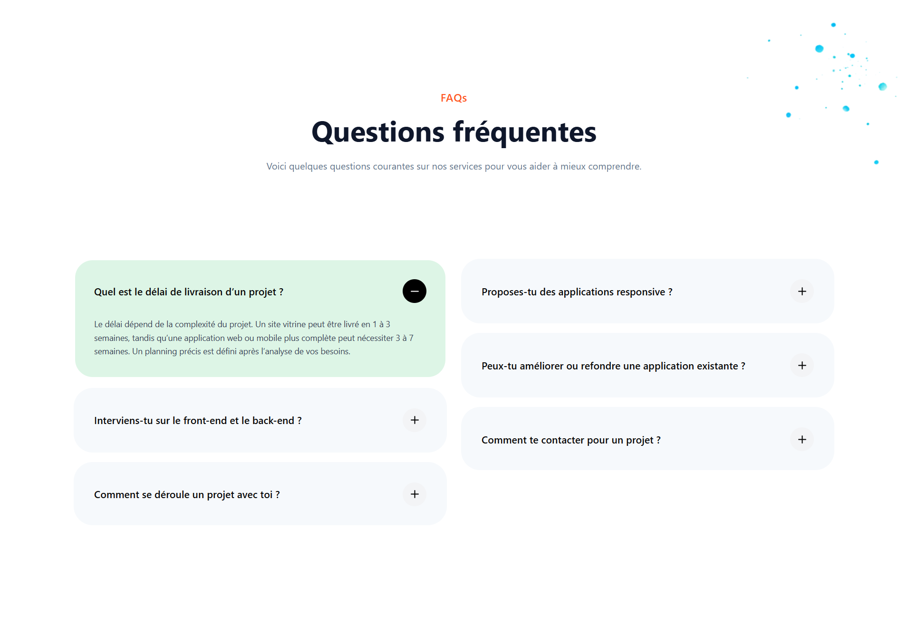
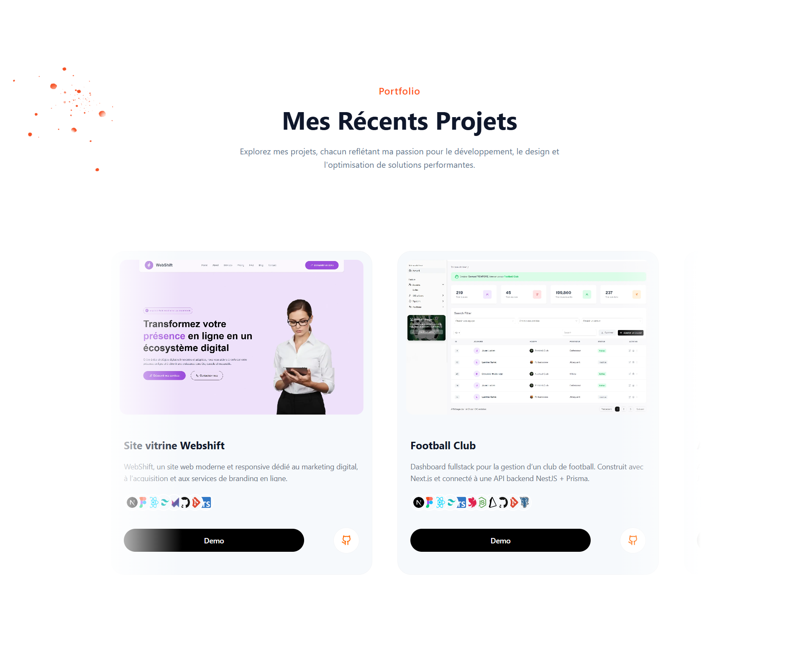
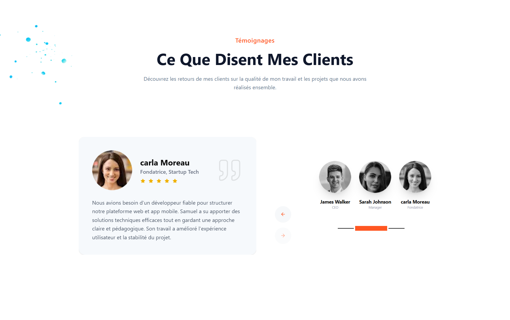
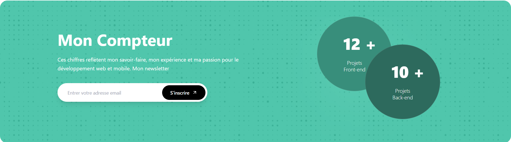
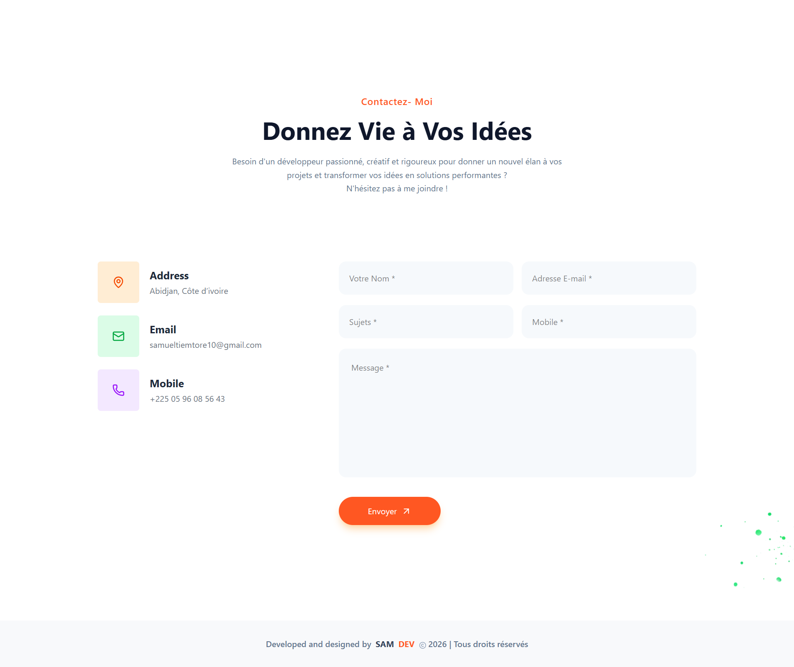

## Samuel Tiemtore – Portfolio Fullstack Développeur

Bienvenue sur mon portfolio personnel.
Ce projet présente mes compétences, mes projets et mon univers en tant que développeur Fullstack.

## Objectif du projet

Ce portfolio me permet de :

- Présenter mes compétences techniques
- Mettre en avant mes projets
- Démontrer mon niveau en UI/UX moderne
- Servir de vitrine professionnelle

---

## Stack Technique

- Next.js 16 (App Router)
- React
- TypeScript
- Tailwind CSS
- Framer motion
- Shadcn UI


## Fonctionnalités

- Design moderne et responsive
- Navigation fluide avec menu mobile
- Animations professionnelles
- Section projets dynamique
- Optimisation des performances (images WebP)
- SEO optimisé

## Screenshots

| Hero | About |
|-------|---------|
|  |  |
| Expertises | Atouts |
|  |  |
| Expérience | Skills |
|  |  |
| Project | Faq |
|  |  |
| Testimonial | Counter |
|  |  |
| contact |
|  | 

## Portfolio

**lien web** :
[sam-dev-portfolio-one.vercel.app](https://sam-dev-portfolio-one.vercel.app)

## Project architecture


```bash

assets/              # screenshots  README

components/          # composant UI globals

public/
└── assets/          # images et ressources

src/
├── app/             # routing et pages Next.js
├── features/        # fonctionnalités 
├── lib/             


README.md            # projet docs

```

## Installation du projet

```bash

git clone https://github.com/SamiTelo/SamDev
cd SamDev
npm install
npm run dev

```

## Contact

- Email: [samueltiemtore10@gmail.com](mailto:samueltiemtore10@gmail.com)
- Tel: +2250596085643

## Licence

Ce projet est sous licence MIT. Tous droits réservés.
